<div style="text-align:center;font-size:2em;font-weight:bold">中国科学技术大学计算机学院</div>

<div style="text-align:center;font-size:2em;font-weight:bold">《数据库系统实验报告》</div>


<div style="display: flex;flex-direction: column;align-items: center;font-size:2em">
<div>
<p>实验题目：学籍管理系统</p>
<p>学生姓名：张延</p>
<p>学生学号：PB21111698</p>
<p>完成时间：2024年6月5日</p>
</div>
</div>


<div style="page-break-after:always"></div>

## 需求分析

#### 1.学生管理

- 学生信息包括学号（primary）、姓名、密码、头像、性别、所属专业、奖项、惩罚、学业状态、重修机会、生日和入学时间。其中学业状态取决于挂科次数，大于等于3次学业状态为“警告”，小于3次为“学业正常”，设计触发器在每次更新选课表时更新学业状态。重修机会初始默认为两次，放弃成绩或退课会使用重修机会，对已修课程进行重修暂时不会使用重修机会，直到更新成绩时会将其减一。
- 管理员能够对学生信息进行增加、删除、修改和查询操作。其中包含了对学生照片也即图像的管理，具体实现为在数据库中存储图像在本地服务器的地址，而图像实际存储在指定文件夹下，在删除学生信息时需先删除文件夹下的对应图片。对学生信息的修改可能会需要修改相应的学生选课信息，比如当修改学生学号或删除学生信息时。
- 学生可以查看自己的基本信息，包括头像、个人资料，成绩以及选课信息等。

#### 2.课程管理

- 课程信息包括课程编号（primary）、课程名称、教师、学分、所属专业和学时。

- 管理员能够对课程进行增加、删除、修改和查询操作。同样，当修改课程编号或删除课程信息时会需要修改相应的学生选课信息。
- 学生也能查看所有的课程信息，但是分为两部分，一部分是已选课程，另一部分是未选课程，这是为了方便后续的选课和退课操作。

#### 3.选课管理

- 选课信息包括（课程编号，学号）（primary），成绩（可以为空），以及该学生是否正在重修该课程。
- 管理员能够对选课信息进行增加、删除、修改和查询操作。其中修改操作只能针对成绩和是否正在重修两项进行，因为课程编号和学号依赖于课程信息和学生信息，若要修改需要在课程管理和学生管理中修改。
- 学生能够登陆查看和修改自己的课程信息，包括课程成绩和选课信息。修改主要体现为能够放弃课程，包括已有成绩和未有成绩的课程，两种情况均需使用重修机会；可以重修课程，此操作会将选课信息的是否正在重修该课程置为true，且暂时不会使用重修机会直到更新成绩；此外还能进行选课，即能选择该学生未在选课信息中出现过的课程，退课和选课成功会增删相应的选课信息。

#### 4.其他

- 除了上述三种信息外，系统还包括了专业信息和学院信息，并支持了对二者的增删改查，删除时同样会删除相应的学生、课程与选课信息。
- 需要能够计算学生的平均成绩进而得出其gpa（算术平均），并显示在学生信息的视图中。
- 在修改表中的外键时需要使用“事务”以保持信息的一致。而删除外键时可以不使用，因为只要按照相应的参照关系的顺序删除就不会影响数据的完整性和一致性。

## 总体设计

#### 系统模块结构


- web前端实现与用户的交互界面，提供相关操作接口。
- 服务端获取用户的相关操作信息并作出反应，通过与数据库交互实现上图中学生操作和管理员操作下面的共九个相关模块，修改数据库中的五个基本表。
- 数据库实现视图、函数、存储过程、触发器、事务等以提供接口给服务端，是之能够对数据库进行增删改查。

#### 系统工作流程


- 用户或管理员通过web前端提供的结构进行操作。
- web前端获取用户或管理员的操作信息并转化为相应数据，通过http的GET或POST请求将数据传输到服务端。
- 服务端根据从前端接收到的数据调用数据库接口或直接使用sql语句操作数据库。
- 数据库返回相应操作的结果或数据。
- 服务端接收到数据库的数据，生成相应html文件交给web前端。
- 前端返回渲染后的html文件给用户或管理员。

#### 数据库设计

##### ER图




关系模式任意实体的任意属性均唯一且不可再分，满足1NF；任意非主属性都完全依赖于主码，满足2NF；任意非主属性均不传递依赖于主码，满足3NF。综上关系模式范式为3NF。

##### 建表（代码均位于[mysite/app/models.py](mysite/app/models.py)）

- 使用django建表，运行`python manage.py makemigrations`和`python manage.py migrate`迁移到数据库。以学生表为例。

```python
class Stu(models.Model):
    id = models.CharField(verbose_name='学号',max_length=10, primary_key=True)
    password = models.CharField(verbose_name='密码',max_length=16, null=False)
    sname = models.CharField(verbose_name='姓名',max_length=32, null=False)
    img = models.ImageField(verbose_name='头像',max_length=32, null=True, upload_to='photos')
    gender_choices = (
        (True, "男"),
        (False, "女"),
    )
    gender = models.BooleanField(verbose_name='性别',default=True, choices=gender_choices)
    major = models.ForeignKey(to="major", to_field="id", on_delete=models.DO_NOTHING)
    prize = models.CharField(verbose_name='奖项',max_length=256, null=True, default='')
    punishment = models.CharField(verbose_name='惩罚',max_length=256, null=True,default='')
    status_choices = (
        (0, "学业正常"),
        (1, "警告"),
        (2, "已毕业"),
    )
    status = models.SmallIntegerField(verbose_name='学业状态',default=0, choices=status_choices, null=False)
    retake_chances = models.SmallIntegerField(verbose_name='重修机会',default=2, null=False)
    birthday = models.DateField(verbose_name='生日',null=False)
    data_in = models.DateField(verbose_name='入学时间',null=False)
```


##### 视图（代码均位于[mysite/app/models.py](mysite/app/models.py)和[lab2/db/view.sql](lab2/db/view.sql)）

- 在MySQL中建立视图，以便在查询时返回完整信息。同时在django中建立相应视图映射到MySQL中的视图。以学生信息为例

```sql
-- lab2/db/view.sql
drop view if exists stu_info;
create view stu_info as
	(select app_stu.id, password, img, sname as name, gender, prize, punishment, status, retake_chances, birthday, 
	data_in, mname as major, dname as department, compute_gpa(app_stu.id) as avg_gpa
    from app_stu, app_major, app_department
    where major_id = app_major.id and department_id = app_department.id order by app_stu.id);
```

```python
class stu_info(models.Model):
    id = models.CharField(verbose_name='学号',max_length=10, primary_key=True)
    password = models.CharField(verbose_name='密码',max_length=16, null=False)
    img = models.ImageField(verbose_name='照片',max_length=32, null=True, upload_to='photos')
    name = models.CharField(verbose_name='姓名',max_length=32, null=False)
    gender = models.BooleanField(verbose_name='性别',default=True)
    prize = models.CharField(verbose_name='奖项',max_length=256, null=True)
    punishment = models.CharField(verbose_name='惩罚',max_length=256, null=True)
    status = models.SmallIntegerField(verbose_name='学业状态',default=0, null=False)
    retake_chances = models.SmallIntegerField(verbose_name='重修机会',default=2, null=False)
    birthday = models.DateField(verbose_name='生日',null=False)
    data_in = models.DateField(verbose_name='入学时间',null=False)
    major = models.CharField(verbose_name='专业',max_length=64, null=False)
    department = models.CharField(verbose_name='学院',max_length=64, null=False)
    avg_gpa = models.FloatField(verbose_name='绩点',null=True)
    class Meta:
        managed = False
        db_table = 'stu_info'
        verbose_name = '学生信息'
```

##### 存储过程（代码均位于[lab2/db/procedure.sql](lab2/db/procedure.sql)）

- 删除学生信息和课程信息。均需先删除选课表中的相应选课信息。

```sql
DELIMITER //
DROP procedure IF EXISTS delete_stu//
CREATE procedure delete_stu(
    in sid varchar(10)
)
BEGIN
    delete from app_sl where stu_id = sid;
    delete from app_stu where id = sid;
END //
DELIMITER ;

DELIMITER //
DROP procedure IF EXISTS delete_les//
CREATE procedure delete_les(
    in lid varchar(10)
)
BEGIN
    delete from app_sl where lesson_id = lid;
    delete from app_lesson where id = lid;
END //
DELIMITER ;
```

- 删除专业信息。先根据专业id获取隶属与该专业的学生和课程id，再据此调用删除学生信息和课程信息的存储过程，最后删除该专业。

```sql
DELIMITER //
DROP PROCEDURE IF EXISTS delete_major//
CREATE PROCEDURE delete_major(
    IN mid VARCHAR(10)
)
BEGIN
    DECLARE done INT DEFAULT 0;
    DECLARE student_id VARCHAR(10);
    DECLARE lesson_id VARCHAR(10);
    
    -- 声明一个游标，用于获取特定 major_id 的学生 id
    DECLARE cur_stu CURSOR FOR
        SELECT id FROM app_stu WHERE major_id = mid;
        
    -- 声明一个游标，用于获取特定 major_id 的课程 id
    DECLARE cur_les CURSOR FOR
        SELECT id FROM app_lesson WHERE major_id = mid;
    
    -- 定义一个继续处理游标的条件
    DECLARE CONTINUE HANDLER FOR NOT FOUND SET done = 1;

    OPEN cur_stu;
    read_student_loop: LOOP
        FETCH cur_stu INTO student_id;
        IF done THEN
            LEAVE read_student_loop; -- 如果学生游标没有更多数据，则跳出循环
        END IF;
        CALL delete_stu(student_id); -- 调用删除学生记录的存储过程
    END LOOP;
    
    CLOSE cur_stu; -- 关闭学生游标

    -- 重置 done 变量，用于处理课程游标
    SET done = 0;

    OPEN cur_les;
    read_lesson_loop: LOOP
        FETCH cur_les INTO lesson_id;
        IF done THEN
            LEAVE read_lesson_loop; -- 如果课程游标没有更多数据，则跳出循环
        END IF;
        CALL delete_les(lesson_id); -- 调用删除课程记录的存储过程
    END LOOP;

    CLOSE cur_les; -- 关闭课程游标
    delete from app_major where id = mid;
END //

DELIMITER ;
```

- 删除学院信息。先根据学院id获取隶属于学院的专业信息，再据此调用删除专业的存储过程，最后删除该学院。

```sql
DELIMITER //
DROP PROCEDURE IF EXISTS delete_dep//
CREATE PROCEDURE delete_dep(
    IN did VARCHAR(10)
)
begin
	DECLARE done INT DEFAULT 0;
    DECLARE major_id VARCHAR(10);
    DECLARE cur_major CURSOR FOR
        SELECT id FROM app_major WHERE department_id = did;
	DECLARE CONTINUE HANDLER FOR NOT FOUND SET done = 1;
    OPEN cur_major;
    read_loop: LOOP
        FETCH cur_major INTO major_id;
        IF done THEN
            LEAVE read_loop;
        END IF;
        CALL delete_major(major_id);
    END LOOP;
    CLOSE cur_major; -- 关闭课程游标
    delete from app_department where id = did;
end//
DELIMITER ;
```

##### 函数（代码位于[lab2/db/function](lab2/db/function.sql)）

- 计算学生gpa。根据学生选课表中的课程成绩，计算算数平均值，再根据对应区间输出其gpa。

##### 触发器（代码位于[lab2/db/trigger.sql](lab2/db/trigger.sql)）

- 增删改选课表各自需要一个触发器，选课表更新时触发，统计相应学生不及格次数，设置相应学业状态。以删除为例，增、改类似。

```sql
DELIMITER //
CREATE TRIGGER sl_delete
AFTER delete ON app_sl
FOR EACH ROW
BEGIN
    declare fail_cnt int default 0;
    select count(*) into fail_cnt from app_sl where stu_id = old.stu_id and grade < 60;
    if fail_cnt >= 3 then
		update app_stu set status = 1 where id = old.stu_id;
	else
		update app_stu set status = 0 where id = old.stu_id;
	end if;
END;
//
DELIMITER ;
```

##### 事务（代码位于[lab2/db/transaction.sql](lab2/db/transaction.sql)）

- 管理重修与放弃课程。is_quit为true表示时是放弃课程，反之则是重修更新成绩操作。首先查询学生此课程的成绩和是否正在重修，再查询正在重修的课程数量和剩余重修机会。若is_quit为true，则放弃成绩从选课表中删除相应信息；否则若新成绩更高，则更新成绩并设置选课信息的重修标志（不论之前是否正在重修，更新成绩后重修标志都应为false）。最后，若重修机会大于正在重修的课程数，或者二者相等，但当前课程就是一门正在重修的课程，则commit，并将state设为0，否则rollback，将state设为-1000。

```sql
DELIMITER //
DROP procedure IF EXISTS retake//
CREATE procedure retake(
    in sid varchar(10),
    in lid varchar(10),
    in is_quit bool,
    in new_grade smallint
)
BEGIN
	declare old_grade, cnt, chances, isretaking, retaking_cnt int default 0;
    select grade, count(*), is_retaking into old_grade, cnt, isretaking from app_sl 
    where sid = stu_id and lid = lesson_id group by grade, is_retaking;
    
    select count(*) into retaking_cnt from app_sl where sid = stu_id and is_retaking = 1;
    
    select retake_chances into chances from app_stu where sid = id;
    start transaction;
    if cnt > 0 then
		if is_quit then
			delete from app_sl where sid = stu_id and lid = lesson_id;
		elseif new_grade > old_grade and isretaking = 1 then
			update app_sl set grade = new_grade, is_retaking = 0 where sid = stu_id and lid = lesson_id;
		elseif new_grade > old_grade then
			update app_sl set grade = new_grade where sid = stu_id and lid = lesson_id;
		end if;
	end if;
	if ((chances > retaking_cnt) or (chances = retaking_cnt and isretaking))  and cnt > 0 then
		update app_stu set retake_chances = retake_chances - 1 where sid = id;
        set @state = 0;
        commit;
	else
		set @state = -1000;
        rollback;
	end if;
END //
DELIMITER ;
```

- 修改学生id等被参照的键时需使用事务同时修改相应参照表中的外键，且需要先关闭外键检查后，修改完成后开启。以修改学生id为例，修改课程，专业，学院id类似。

```sql
DELIMITER //
DROP procedure IF EXISTS edit_stu_id//
CREATE procedure edit_stu_id(
    in old_id varchar(10),
    in new_id varchar(10)
)
BEGIN
	start transaction;
	SET FOREIGN_KEY_CHECKS = 0;
    update app_stu set id = new_id where id = old_id;
    update app_sl set stu_id = new_id where stu_id = old_id;
    SET FOREIGN_KEY_CHECKS = 1;
    set @state = 0;
    commit;
END //
DELIMITER ;
```

## 核心代码解析（可改名为对应模块，如后端实现）

#### 仓库地址

> 建议使用github、gitlab、gitee等代码托管网站进行开发，并在**实验验收结束前**设置为**private**，结束后改为**public**

#### 目录

> 使用tree命令获取文件结构，并在文件名后用 "-------注释" 解释文件功能

#### 标题1

> 分为若干个标题，以一定逻辑顺序讲解代码，如按ER图实体、关系讲解数据库建模代码，按存储过程、触发器分类讲解代码、按前端实现、接口等讲解前端代码
>
> 注意不要无脑粘贴代码，选取具有代表性的代码讲解，并注明文件来源，如首行注释: // backend\models.py

## 实验与测试

#### 依赖

> 所需的库、运行环境

#### 部署

> 代码运行步骤，建议使用命令行运行代码

#### 实验结果

> 如增删改查、验证存储过程、函数、触发器、文件管理

## 参考

> 如前端使用的模板、引用的图片来源、第三方库的官网等等